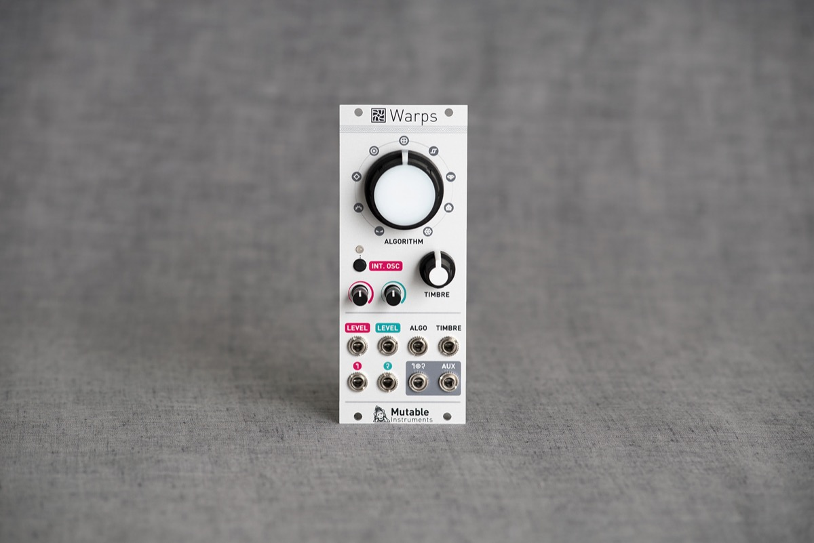
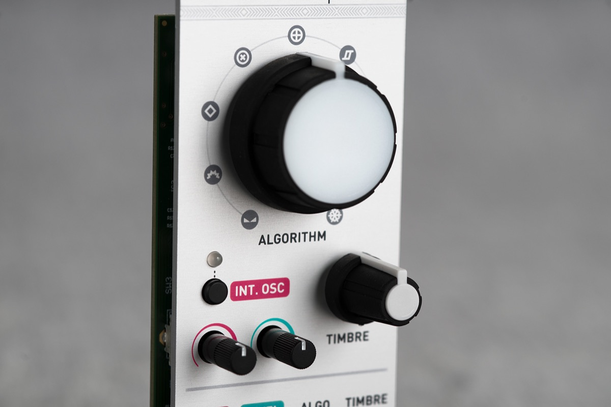
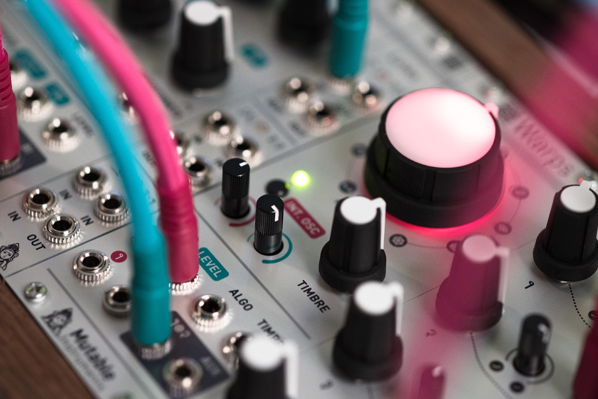

## Modulating modulations

Evolved from the oscillator mixing section of Mutable Instruments’ desktop hybrid synths, Warps is designed to blend and combine two audio signals.

A variety of wave-shaping and cross-modulation methods – some of them emulating classic analog circuits, some of them purely digital – are provided by the module.

With Warps, the cross-modulated sound can be sculpted with control voltages along 4 dimensions: by controlling the amplitude and distorting the input signals, by smoothly scanning through the collection of modulation algorithms, and by adjusting a timbre parameter controlling the brightness/harshness of the modulated signal.

Since many classic cross-modulation effects work best when the carrier is a simple waveform – for example, a sine wave for ring-modulation or a buzzing waveform for vocoding – Warps includes a digital oscillator offering a handful of classic waveforms. This internal oscillator, which tracks V/Oct and supports through-zero FM, will replace the carrier audio input – freeing up one oscillator in your system for other duties!

