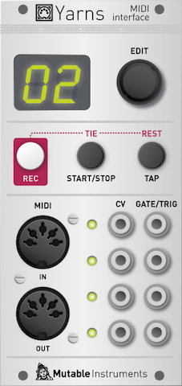
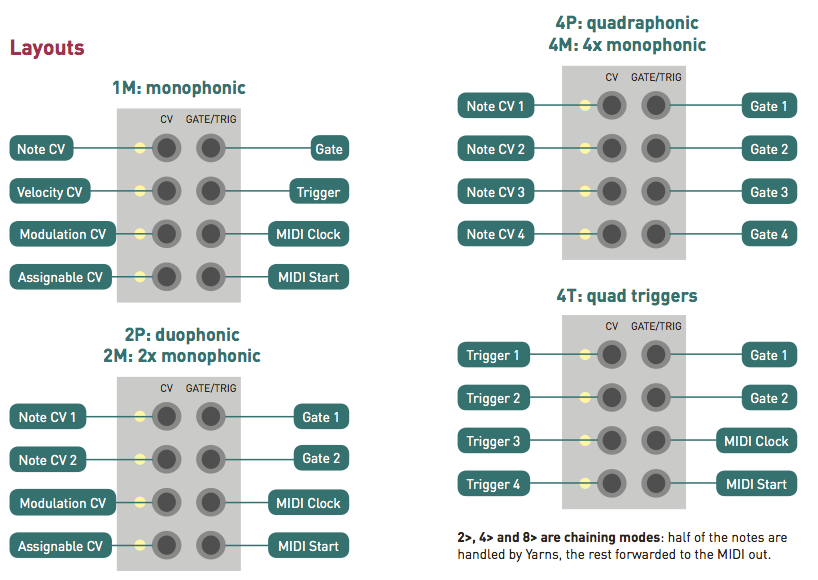

This manual documents the latest version of the firmware, v1.5, which can be downloaded [here](../firmware).

## Overview

Yarns is a MIDI to CV interface. Thanks to its flexible architecture, it can manage up to 4 voices of polyphony or up to 4 individual channels. Yarns embeds an arpeggiator, a note sequencer, and an euclidean pattern generator.

## Installation

Yarns is designed for Eurorack synthesizer systems and occupies 12 HP of space. It requires a **-12V/+12V** supply (2x5 connector), consuming 2mA from the -12V rail and 60mA from the +12V rail. The red stripe of the ribbon cable must be oriented on the same side as the "Red stripe" marking on the printed circuit board.

## Controls

At the right of Yarns' display is an encoder which is used to increment/decrement values and scroll through options. The typical way of modifying Yarns' settings is to scroll through the list of settings, click the encoder to select one of them, then rotate the encoder to increment/decrement the value of setting, and click again once you are done. Yarns' display is small, so settings names are abbreviated into 2 letters code (VR = "Vibrato range"). To ease navigation, the unabbreviated form of each setting or value scrolls on the display after a few seconds of inactivity.

Below the display are 3 buttons, whose primary functions are to control the sequencer:

-   **REC** starts and ends step-by-step recording.
-   **START/STOP** starts and stops the sequencer.
-   **TAP** acts as a tap-tempo.

In addition:

-   In recording mode, **START/STOP** and **TAP** enter a tie step (extends the duration of the previous note onto this step) or a rest (blank step) in the sequence.
-   Holding the **START/STOP** button for a few moments latches the arpeggiator (if it is running), or starts and hold a note. More on that in the *Latch and keyboard-free operation* section!

## Yarns' architecture: voices, parts and layouts

Three important concepts are used throughout this documentation: *voice*, *part*, and *layout*.

You can think of a *voice* as a group of CV and Gate outputs working together to convey information about a single note of music. A traditional monophonic MIDI interface manages only one voice. In its simplest expression, a voice would need only one CV output (to output the note frequency information), and one Gate output (to output the note on/off status) - though additional CV and Gate signals can be produced, for example an extra trigger or a velocity CV.

A *part* is a group of voices responding to the same MIDI channel. Whenever a note is played on this MIDI channel, it will be dispatched to one of the voices in the group.

Yarns can handle up to 4 parts, and there are enough CV/Gate outputs for 4 voices. This means that there are many different ways of getting these to work together! Each of these configurations are called *Layouts*.

Yarns provides the following layouts:

-   **1M**. Monophonic. Yarns offers a single voice of CV/Gate conversion.
-   **2M**. Dual monophonic. Yarns provides two independent monophonic voices. The voices are independent in the sense that they can play different sequences, respond to different MIDI channels, etc.
-   **4M**. Quad monophonic. Yarns provides four independent monophonic voices.
-   **2P**. Duophonic. Yarns provides a single part made of two voices. The incoming notes are dispatched to these two voices.
-   **4P**. Quadraphonic. Yarns provides a single part made of four voices. The incoming notes are dispatched to these four voices.
-   **2&gt;**. Duophonic with polychaining. Yarns provides a single part made of two voices. However, only the first voice is handled by Yarns' CV/Gate outputs. The second voice is simply forwarded as MIDI Note on/off messages the MIDI out. This allows "ping-pong" play between the modules connected to Yarns and another MIDI instrument. This can also be used to chain several instances of Yarns to get more CV outputs.
-   **4&gt; and 8&gt;**. Quadraphonic and octophonic with polychaining. Yarns provides a single part made of 4 or 8 voices. Only the first half of the voices are handled by Yarns' CV/Gate outputs. Notes allocated to the other voices are forwarded to the MIDI output.
-   **4T**. Quad trigger mode. This layout is optimized for controlling percussion patches (for example from MIDI drum pads, or from a MIDI drum sequencer). It offers 4 parts, each of them listening to a single MIDI note. No control-voltage is emitted - just a trigger, freeing some outputs to emit additional gate and clock signals.
-   **4V**. Raw conversion of continuous controllers into CVs.
-   **3+**. Polyphonic + monophonic. This layout provides a combination of a 3-voice polyphonic part, and a monophonic part, for example for chords and a bass line.

The layout can be changed by selecting the LA(YOUT) setting, clicking the encoder, selecting a layout in the list, and clicking the encoder to confirm.

## CV/Gate outputs mappings

Yarns offers 4 CV outputs and 4 Gate outputs. What do they correspond to? It all depends on the selected layout!

### Single voice Layouts

In single-voice layouts (**1M**, and **2&gt;**), the 4 CV outputs are assigned to:

-   V/Oct note
-   Velocity
-   Modulation wheel
-   Assignable (aftertouch, expression pedal, breath controller, LFO... More on that in the "Layout and MIDI options")

The 4 gate/trigger outputs are assigned to:

-   Gate (a signal at a +5V level whenever a key is pressed and held)
-   Trigger (short pulse at the beginning of each note)
-   Clock
-   Start/bar trigger (more on that in the "Clock and tempo" section).

### Dual voice Layouts

In dual-voice layouts (**2M**, **2P** and **4&gt;**), the 4 CV outputs are assigned to:

-   Voice 1 V/Oct note
-   Voice 2 V/Oct note
-   Modulation wheel
-   Assignable

The 4 gate/trigger outputs are assigned to:

-   Voice 1 gate
-   Voice 2 gate
-   Clock
-   Start/bar trigger

### Quad voice layouts

In four-voice layouts (**4M**, **4P**, **8&gt;**, **3+**), the 4 CV outputs are assigned to each voice's V/Oct note. The 4 gate/trigger outputs are assigned to each voice's gate.

It is also possible to repurpose channel 3 and 4's gate outputs as a clock and start/reset signal, with the **C&gt;** setting.

### Quad triggers layout

In the quad trigger layout (**4T**) mode, which is optimized for percussions patches, the 4 CV outputs emit excitation pulses. In their simplest form, the excitation pulses are the +5V trigger you've learnt to love - but options are provided to stretch them in time, shape them like envelopes, or even scale them with velocity! This produces signals particularly useful for "pinging" filters, low-pass gates, or tuned delay lines.

The 4 gate/trigger outputs are assigned to:

-   Voice 1's trigger with routing controlled by voice 2's gate.
-   Voice 1's trigger with routing controlled by voice 2's gate.
-   Clock
-   Start/bar trigger

A word about this mysterious voice 1/2 routing affair... Here is how it works: if voice 2 is off when a trigger arrives on voice 1, it'll come out of the trigger output 1. If voice 2 is on when a trigger arrives on voice 1, it'll come out of the trigger output 2. This feature can be used creatively for getting the same drum sound (voice 1) played differently depending on whether it is played alongside another drum sound (voice 2). Don't panic though - the regular triggers are of course available on the 4 CV outputs!

### Quad CV layout

In the **4V** layout, a MIDI channel and a CC is assigned to each part. The corresponding CC messages are mapped to the 0V to 5V range and output on each CV output. The gate/trigger output will output +5V when a note is held on the assigned channel, 0V otherwise.

### Summary

## Layout and MIDI options

This section lists the different settings related to layout and MIDI reception.

**LA(YOUT)**: Voices/parts layout. The different options have been exposed in the "Yarns' architecture" section.

**PA(RT)**: Active part. Many settings - such as the MIDI channel, arpeggiator pattern, etc. - can be set to different values for each part. When a layout is made of several parts (2M, 4M, 4T), this setting is used to select the part to modify. This option is not visible in mono-timbral layouts.

**CH(ANNEL)**: MIDI reception channel. A part can be made to respond to all MIDI channels (omni mode).

**NO(TE)**: MIDI reception note. This option is only shown with the 4T layout, in which each part is triggered by a different MIDI note.

**&gt;&gt; (OUTPUT MIDI MODE)**: MIDI output routing. When set to OFF, none of the events received by this part are forwarded to the MIDI out. When set to THRU, all events received by this part are forwarded to the MIDI out without any processing. Finally, when set to AR(P/SEQ), all the notes generated by this part's arpeggiator/sequencer are sent to the MIDI OUT.

**VO(ICING)**: Voice allocation method. This option is shown when more than one voices are assigned to the part (2P, 4P, 2&gt;, 4&gt;, 8&gt;):

-   **PO(LY)** is a natural voice-stealing algorithm: when a new note is played, the least recently triggered voice is used.
-   **CY(CLIC)** dispatches the note to each voice one after the other. This is a very naive approach to polyphony!
-   **RA(NDOM)** randomly assigns the note to a voice.
-   **VE(LOCITY)** dispatches low-velocity notes to the first voice, high-velocity notes to the last one, and anything else in-between.
-   **SO(RTED)** dispatches the lowest note to CV/Gate outputs 1, the second note to CV/Gate outputs 2 and so on, from lowest to highest on the keyboard. Releasing a key does not reassign notes to channels.
-   **U1** and **U2** are unison modes. When a single note is played, it is routed to all available output channels in unison; but when a chord is played, each note of the chord is dispatched to a different voice (lowest note to the first channel, highest note to the last channel). This option is available in the 2P mode to recreate the behaviour of pseudo-duophonic synths like the Polivoks or Odyssey. It is also available in the 4P mode even if, to our knowledge, no polysynth ever had such a feature! The difference between the variants 1 and 2 is the following: when two keys are held, and one of the keys is released, **U1** reassigns the remaining note to all channels (hardcore Odyssey behavior) ; while **U2** doesn't change anything (nice for playing and letting decay 2-note chords).
-   **ST(EAL MOST RECENT)** steals the most recently played note when the maximum polyphony is reached. This allows you to hold a note or chord on the left hand, and play legato a melody on the right hand that won't cut the chord.

**NP (NOTE PRIORITY)**: Note priority. This option is only shown when a single voice is assigned to a part, and decides what to do when several keys are pressed simultaneously. The LO(W)est and HI(GH)est note priority options are "historical" settings, reproducing the behavior of early keyboard scanners. LA(TEST) note priority is the most natural behavior and is the one found in modern monosynths. You play and hold a C... you get a C. You play a G... the G takes over. Now you release the G... the C springs back.

**RC (REMOTE CONTROL CHANNEL)**. This specifies a MIDI channel which can be used to simultaneously control the parameters of each of the four parts. Please refer to [the MIDI implementation chart](https://docs.google.com/spreadsheet/pub?key=0Ai4xPbRS5YZjdDlVWG5XWFZuM1I3X08tdVQ2eU5WT0E&gid=1).

## CV, gate and trigger generation parameters

The first sections were focusing on how MIDI messages flow through the unit - sent in parallel to parts and then allocated to voices. This section presents the options related to the CV/Gate conversion itself. Note that some of these options might not be available with the 4T layout - portamento or vibrato are not very relevant to rhythmic pulses!

**LG (LEGATO)**: This setting is only available in the monophonic layouts (**1M**, **2M**, **4M**), and controls how the gate output and portamento respond to overlapping notes.

-  **OFF**: A trigger is sent at each new note, and portamento is applied to the note CV irrespectively of the playing style.
- **AU(TO PORTAMENTO)**: Notes played legato are not retriggered, and portamento is applied only on notes played legato.
- **ON**: Notes played legato are not retriggered, portamento is applied to the note CV irrespectively of the playing style.

**PO(RTAMENTO)**: Portamento speed. This setting controls the time taken by notes to glide into one another. The first values, displayed as **T0, T1, T2**... up to 50 correspond to constant-time (RC filtering, exponential curve) portamento. The following values, displayed as **R0, R1, R2**... up to 50 correspond to constant-time (slew-limiting, linear ramp) portamento.

**BR (BEND RANGE)**: Pitch bend range in semitones. Controls by how many semitones (up to 24) the note is shifted up or down when the pitch bend lever is set to its extreme positions. When this setting is 0, pitch-bend is disabled.

**VR (VIBRATO RANGE)**: Vibrato range in semitones. The vibrato amount is controlled by the modulation wheel. When this setting is 0, vibrato is disabled.

**VS (VIBRATO SPEED)**: Vibrato speed. The last settings are clock divisions - in this case the vibrato LFO will be locked to the MIDI clock.

**T- (TRIGGER DURATION)**: Duration of the trigger pulse. With the **1M** or **2&gt;** layouts, the trigger duration is expressed in milliseconds. In 4T mode, the trigger duration follows an exponential scale, to reach durations in the order of seconds. Other layouts do not offer trigger outputs.

**T\* (TRIGGER SCALING)**: This setting (available only with the **4T** layout) can scale the amplitude of the trigger output according to velocity. This is of no use when using the trigger as a logic signal (for example to start an envelope), but suddenly makes much more sense when the trigger is used to "ping" a filter or LPG; or when it is directly used as an envelope or modulation source sent, for example, to a VCA.

**T/| (TRIGGER WAVESHAPE)**: Various shapes of trigger pulses are available, producing different results when "pinging" filters. **SQ** is the standard square "logic" pulse. **LI(NEAR)** is a linear decay. **EX(PO)** is an exponential decay. **RI(NG)** is a short sinusoidal burst with an exponential decay, similar to a damped kick or to a clave depending on the trigger duration. **ST(EP)** is a rapid-fire sequence of pulses with decaying amplitude. Finally, **BU(RST)** is a burst of white noise with an exponential decay.

**3>, 4>, CV**: This setting controls which signal is sent to the 3rd (and/or 4th) CV output in the single and dual voice layouts. The options are: **VE(LOCIY)**, **MO(DULATION)** (MIDI CC\#1), **AT(AFTERTOUCH)**, **BR(EATH)** controller (MIDI CC\# 2), **PE(DAL)** (MIDI CC\#4), pitch **BE(ND)**, **VI(BRATO LFO)** - which is a triangle LFO whose amplitude is controlled by the modulation wheel, and whose speed is controlled by the **VS (VIBRATO SPEED)** setting. **LFO** is similar to **VIBRATO LFO**, except that the amplitude is constant, instead of being controlled by the modulation wheel.

## Yarns as (an) oscillator(s)

Some of Yarns' CV output channels can be reconfigured as digital oscillators. To do so, select the **OS(CILLATOR)** setting. The available waveforms are sawtooth, 25% rectangle, square, triangle and sine. The oscillator signal is produced:

-   On CV4 in monophonic mode (1M)
-   On CV3 and CV4 in duophonic modes (2M or 2P)
-   On CV1, CV2, CV3, CV4 in quadraphonic modes (4M or 4P)

The first setting of the OS parameter **(OFF)** disables audio output and causes the channel to behave as a CV output as expected.

## Tuning systems

Yarns uses highly accurate 16-bit DACs for CV conversion, and is capable of very precise control over tuning.

**TT (TRANSPOSE)** applies a coarse transposition to the input note, expressed in semitones. Note that this is equivalent to a keyboard transposition, rather than an offset on the output voltage - this might not matter much when using equal temperament, but matters when other tuning systems are used.

**TF (FINE TUNING)** applies a fine transposition to the output CV, expressed in 1/128th of a semitone (0.65mV increments).

**TS (TUNING SYSTEM)** selects alternative scales and tuning systems. **EQ(UAL TEMPERAMENT)** is the default choice. **JU(ST INTONATION)** uses a simple algorithm to adjust each note by a few cents within its equal temperament value to increase consonance with the notes played on the other channels, or the most recently played notes. **PY(THAGOREAN)** uses a pythagorean scale, in which all notes' frequency ratios are expressed as rational numbers (as opposed to powers of 2\^-1/2 for equal temperament). **EB**, **E**, and **EA** have these respective notes shifted down by one quartertone. The settings numbered from 01 to 27 are ragas from the [Maihar Gharana](http://en.wikipedia.org/wiki/Maihar_gharana) - these settings not only affect tuning but also eliminate some notes from the scale to leave only the shrutis belonging to the raga. The last setting, **CU(STOM)** uses an octave pitch table which can be sent by SysEx using the [MIDI Tuning Scale/Octave Extensions (CA-021/RP-020)](http://www.midi.org/techspecs/midituning.php) of the MIDI standard. This [web app](https://scale-editor-350013.ew.r.appspot.com/) can be used to create tunings using the very popular Scala scale description language.

**TR (TUNING ROOT)** acts in the same way as a transposition control, but instead of shifting notes up/down, it rotates up or down the tuning table (whether it is one of the preset tables or the one received by MIDI). For example, if a tuning table with a quarter-tone E has been programmed, setting TR (TUNING ROOT) to C\# will rotate the tuning table one semitone up, and the quarter-tone will be on the note F instead. This setting has no effect in equal temperament tuning. For the ragas settings, this is equivalent to moving the "Sa" up or down on the keyboard.

**Tx TUNING FACTOR** multiplies or divides the output voltage in order to obtain interesting scales (for example, a whole octave stretched to 24 keys, or reversely, 2 octaves crammed in 12 keys). [Here is a nice illustration](images/tuning_factor.jpg) from the D50 manual showing what can be achieved with this feature. The last setting corresponds to an alpha scale (ratio of 0.77965). Note that the **TR TUNING ROOT** setting determines the central key around which tuning is stretched.

## Clock and tempo

Before diving into the sequencer and arpeggiator, a presentation of Yarns' clocking system... All the timing information for the sequencers, arpeggiators, and euclidean pattern generators derive from the same clock - though each part can be tuned to its own subdivision of this clock.

#### Clock settings

Yarns can use either its own internal clock, or an external MIDI clock source. The tempo is adjusted by modifying the **TE(MPO)** setting. Below 40 BPM, the display shows **EX(TERNAL)** - which means that the internal clock will not be used and that external MIDI clock messages are expected. Note that the display only shows the last 2 digits of the tempo; but rhythmically blinks - so there's no confusion between 60 and 160, or 120 and 220! The tempo can also be set by tapping on the tap tempo button on the front panel.

Some swing might be applied to the clock - its amount is controlled by the **SW(ING)** setting.

A divider is applied to this tempo. Its ratio can be controlled by the **I/ (INPUT CLK DIV)** setting. This can be used to create drastic tempo changes in a sequence.

The **MS (MANUAL START)** setting prevents the internal clock from automatically starting when a key is pressed. When this setting is active, the internal clock can only be started by pressing the **START/STOP** button on the front panel.

#### Clock output settings

With single and dual voice layouts (**1M**, **2M**, **2P**, **2&gt;**, **4&gt;**), or with the quad-trigger layout (**4T**), a clock and bar/reset output is available on gate outputs 3 and 4. In the quad voice layouts (**4M**, **4P**, **8&gt;**), gate outputs 3 and 4 are reserved for controlling the gate of voice/channel 3 and voice/channel 4. However, these outputs can be replaced by clock and bar/reset outputs, by enabling the **C&gt; (CLOCK OUTPUT)** setting.

The clock output emits a pulse signal at a division of the main clock. The rhythmic subdivision is selected by the **O/ (OUTPUT CLK DIV)** setting - the default value being **16 (1/16th note)**. The start/bar trigger output emits a trigger whenever the sequencer is started, but can also be configured to re-emit a trigger every Nth quarter note. This value is defined by the **B- (BAR DURATION)** setting. Set it to oo and a pulse will only be emitted when the sequence start. Set it to, for example, 4, and a pulse will be emitted at the beginning of each 4-beats bar. Set it to 0 and the output will stay high while the sequence is running.

Some sequencers do not handle correctly the simultaneous reception of a clock and reset pulse. The  **NU(DGE FIRST TICK)** setting increases the delay separating the reset pulse and the first clock pulse. This may solve synchronization issues!

## Arpeggiator / Euclidean Generator

The arpeggiator allows chords to be transformed into monophonic sequences, according to preset arpeggio movements (up, down) and rhythmic patterns. In addition, an Euclidean generator can take over the arpeggiator's rhythmic generator. This section describes all settings related to arpeggiation.

**C/ (CLOCK DIV)**: elementary rhythmic division of the patterns generated by the arpeggiator and sequencer (in other words: step duration or "scale" in x0x speak). The default setting is 1/16 (1/16th note).

**G- (GATE LENGTH)**: duration of the events generated by the arpeggiator and sequencer - expressed as a number of steps. For example, if the clock division is 1/16 and the gate length is 4, the duration of the notes generated by the arpeggiator will be 1 quarter note.

**AR (ARP RANGE)**: arpeggiator range in octaves. The arpeggiator does not run when this setting is zero. Note that when the **4T** layout is selected - this setting is called **RG (RHYTHMIC GENERATOR)** and provides only ON and OFF setting - talking about arpeggiation range and direction does not make a lot of sense when dealing with rhythms... but it's still the same arpeggiator and euclidean sequencer doing the hard work! Settings related to arpeggiator direction are not displayed either.

**AD (ARP DIRECTION)**: arpeggio type. The first options are the classic UP, DN (down), UD (up & down) and RA(NDOM) modes. PL(AYED) arpeggiates the notes in the order in which they have been pressed. CH(ORD) is a gated chord effect - rhythmically repeating all pressed notes.

**AP (ARP PATTERN)**: arpeggiator rhythmic pattern. Note that when the euclidean generator is enabled, it takes control of the rhythmic pattern and this setting is ignored. This setting is called **RP (RHYTHMIC PATTERN)** when the 4T layout is selected.

**E- (EUCLIDEAN LENGTH)**: length of the euclidean pattern. When set to 0, the euclidean generator is disabled, and the AR (ARP PATTERN) setting is used. Otherwise, this sets the duration, in steps, of the rhythmical pattern.

**EF (EUCLIDEAN FILL)**: number of filled steps in the euclidean pattern. For example length = 4 and fill = 1 will give a basic 4/4 "Four to the floor" beat. Fill = 2 will create a pattern of eighth notes instead. Fill = 3 produces a pattern of 3 sixteenth note and a sixteenth note rest. Finally, fill = 4 will create a pattern of sixteenth notes. More complex patterns can be created by increasing the length, and using odd values for Fill!

**ER (EUCLIDEAN ROTATE)**: this setting shifts and wraps the euclidean pattern. This is particularly useful when using several parts (for example in 4T mode to drive 4 percussive sub-patches). If two parts are configured with the same settings (For example length = 4 and fill = 1 to get a "four to the floor" beat), they will be synchronized and this can be boring. The rotate setting can be used to offset a part with respect to the other, and create more interesting rhythms.

## Playing with Yarns: latch and keyboard-free operation

Yarns' arpeggiator starts immediately whenever a key is pressed on the keyboard. When all keys are released, the arpeggiator continues running for a few clock ticks (a length equivalent to an eighth note); and if no key has been pressed in this short period, it stops. This short window allows glitch-free play when transitioning from one chord to another in an arpeggiated sequence.

The arpeggiator has a latched mode. While an arpeggio is playing, hold the **START/STOP** button for a second to latch the arpeggiator. The display shows "//". In latched mode, releasing all keys will no longer stop the arpeggiator - the arpeggiated pattern will continue until a new chord is played. To leave the latched mode, press the **START/STOP** button again. This will not stop the arpeggiator - instead, it will continue with the current pattern, until a new key is pressed.

Yarns also provides a way of triggering one-note arpeggios or hold notes without the need for an external keyboard. Hold the **START/STOP** button for a second. A note will be played and held. Its value is shown on the screen and can be adjusted using the encoder. Click the encoder to access other settings, and press the start/stop button again to stop the held note.

## Sequencer

A monophonic, 64-step sequencer is available for each part. The sequencer is inspired by the SH-101, in that the primary way of inputting sequences is to use a keyboard and record the notes step by step.

Each step can store either:

-   a note (with its velocity value and a "slide" status).
-   a rest, which indicates a silent step.
-   or a tie, whichs indicate that the note triggered at the previous step is not stopped, but rather prolonged unto this step.

To record a sequence, press the **REC** button. When a multi-timbral layout is used, the display will blink to let you select which part has to be recorded. Select a part number and click the encoder to confirm.

The display then indicates the index of the step to be recorded. Play a note on the MIDI keyboard to add it to the sequence. Press one of the **TIE** or **REST** buttons to insert a tie or rest. Press **REC** when you are done, to leave the recording mode. Observe that the sequencer goes back to step 1 once you go past the 64th step - the sequence is not lost when this happens!

303-style slides can be recorded by wiggling the pitch-bend lever before playing a note. The exact motion of the pitch-bend lever will not be recorded - but the sequencer will remember that the following step will be played with a long portamento.

In case an error is made during recording, the encoder can be used to go back to a previously recorded step and re-record it.

Recording notes without keyboard is also possible: Click the encoder, select a note (it will be sent to the CV output so you can hear the result), and click the encoder to enter it. Notes recorded this way always have a full velocity.

To play a sequence, press the **START/STOP** button. To stop playback, press the **START/STOP** button again. When the unit is configured to use an external clock, the sequencer can also be started/stopped by sending the corresponding MIDI messages. While the sequencer is playing, the keyboard can be used to transpose the sequence. In monotimbral modes, transposition is relative to the first note in the sequence.

While a sequence is playing, pressing the **REC** button will put the unit in recording mode, but the original sequence will not be immediately erased. Instead, it will continue looping and be progressively replaced by the notes you input. This allows the sequence to be edited and rewritten on the fly while it is playing.

An important thing to remember about the sequencer is that the sequencer and arpeggiator cannot be used together. When the **START/STOP** front panel button is pressed, or when a MIDI start message is received, the sequencer starts. When the sequencer is not running and a Note message from the keyboard is received, the arpeggiator starts instead.

## Saving, recalling and backing up programs

8 memory slots are available to store and recall programs - which capture all of Yarns' settings including sequences and the tuning information received by MIDI.

Press the encoder for a second to display the load/save menu. When this menu is displayed, the display pulsates. Select **\*L(OAD\*)** and click the encoder to select the number of the program you want to load. Select **--** to cancel.

Select **\*S(AVE\*)** and click the encoder to save the current settings into one of the 8 slots. Select **--** to cancel.

Select **\*I(NIT\*)** and click the encoder to reset the current settings to basic settings (120 BPM, mono layout, no arpeggiator or sequencer).

Select **\*Q(UICK SETUP\*)** and click the encoder to rapidly build a setup from notes input from a MIDI keyboard (see next section).

Select **\*&gt;(SYSEX DUMP)\*** to send the current settings as a block of SysEx data to the MIDI out. They can be recorded in a SysEx librarian utility and sent back later to restore these settings.

**\*C(ALIBRATE)\*** displays the calibration menu (see next section).

**\*E(XIT)\*** leaves the LOAD/SAVE menu.

When Yarns is powered on, the first program (P1) is always loaded. It is recommended to regularly save your work there.

## Quick setup

Yarns offers a "quick setup" option to rapidly cut through the menu diving when setting up channels and layouts. Press the encoder for a second to display the load/save menu. Select \*Q(UICK SETUP\*) and click the encoder to start. The display shows "++". Play notes from your keyboard(s)/controller(s) and click the encoder.

-   If only one note has been played, a monophonic setup (1M) is created for the channel on which the note has been received.
-   If two notes have been played on the same channel, a duophonic (2P) setup is created. More than 2 notes, and a quadraphonic (4P) setup is created.
-   If notes have been received from 2 or more different channels, a multi-timbral setup is created for these channels (2M or 4M).
-   If adjacent notes (such as B and C ; or F and F\#) have been played, a split is created at this point.
-   If all notes are received on channel 10 (traditionally assigned to drums in the GM standard), a Triggers setup (4T) is created, with each part being triggered by one of the played notes.
-   If some notes are received on channel 10, and some notes on other channels, a multi-timbral setup is created, with one part per note on the channel 10 (for triggering percussions), and general purpose monophonic parts assigned to the other channels.

## Calibration procedure

A multimeter with at least 4 1/2 digits of precision is needed for this step.

To enter the calibration menu, press the encoder for one second and select **\*C(ALIBRATE)\*** in the list. The display shows the active CV output. Use the encoder to select the output to calibrate, or select OK to exit the calibration mode.

Once a CV output has been selected, connect a patch cable from this output to your multimeter. The display indicates the voltage, in Volts, that should be read on the multimeter (-3 at the beginning of the procedure), when measuring the voltage between ground and the CV output of the module. If the reading is incorrect, click the encoder (the display blinks), and rotate the encoder until the target voltage is reached. Each increment corresponds to about 0.2mV. You can also hold the **TAP** button while rotating the encoder for a faster adjustment, by 6mV increments. Click when you are done - the display no longer blinks. Select the next voltage in the list, and do the necessary adjustments. Calibration has to be done for all voltages between -3V and +7V. Select "OK" after the last voltage has been adjusted. The part selection menu is shown. Calibrate the other CV output channels if necessary.

##  Firmware update procedure

Power on your modular system with Yarns' encoder pressed. The first character of the display will show a "snake" pattern. Yarns is now waiting for a SysEx data transfer on its MIDI input port.

The SysEx data needs to be sent with a delay of at least 100ms between packets. As packets are received, the number on the screen is updated, indicating the total amount of data, in kilobytes, received. The firmware contains between 64 and 100 packets.

Once the last packet has been received, **OK** is displayed, and the unit restart after one second.

In case of a transmission error, the display shows **Er** and you have to restart the transmission. Try increasing the delay between bytes and/or the delay between packets - some MIDI interfaces have rather small buffers and choke on large blocks of SysEx data. We recommend Elektron's C6 tool (available for both Windows and OS X) or Snoize SysEx Librarian.
