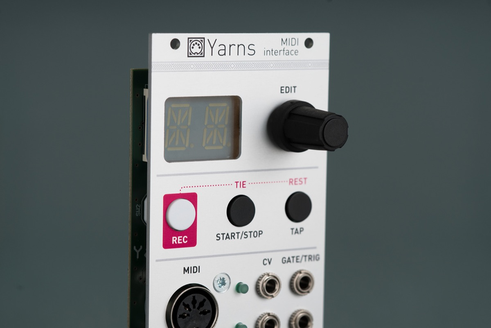

## The MIDI CV/Interface that can do more

### Multichannel MIDI to CV/Gate conversion

Yarns is a MIDI interface providing up to 4 channels of very accurate CV/Gate conversion, which can be assigned to up to 4 voices.

In single voice mode, note, velocity, modulation and aftertouch (or other CC) CV are produced, along with a gate, a trigger, and a clock/reset output.

In two voices mode, two channels of note, modulation or aftertouch CV are produced, along with two gates, and clock/reset outputs.

Finally, in four voices mode, four pairs of CV/Gate outputs are provided.

Each voice has a built-in digital LFO to interpret modulation wheel messages as a vibrato; can respond to pitch-bend messages; or can be smoothed with a glide/portamento control – no need for a dedicated module and patches to get the right response from a MIDI keyboard!

### Monophonic and polyphonic

The 2 and 4-voice modes are available both in a "polyphonic" and "multitimbral" flavour. The former receives chords from one single MIDI channel and dispatches them to the voices; while the later provides independent monophonic parts – which can be addressed to different MIDI channels, keyboard ranges, or even velocity levels.

Various note priority modes (low, high, last) and polyphonic allocation schemes (voice-stealing, random, cyclic) allows you to fine-tune the CV/Gate conversion to your playing style.

### With sequencing and note transformation...

Each part can generate sequences either through an arpeggiator/euclidean sequencer combo; or with a SH-101 style sequencer with step-by-step recording, storing up to 64 notes. The module can sync to an external MIDI clock, and generate a clock/reset output at any subdivisions of the MIDI clock.

### ... and even more advanced features

Other unique features include support for microtunings (either through standard MIDI messages or from a selection of historical tunings or indian ragas), just intonation, and an audio output mode which can transform one, two, or four of the CV outputs into simple digital oscillators.

