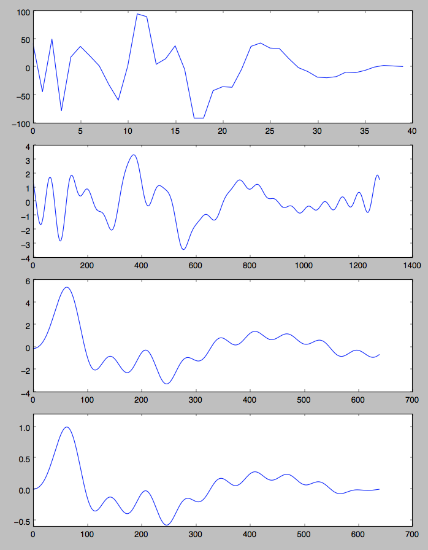

## `NaiveSpeechSynth`

[Code](https://github.com/pichenettes/eurorack/blob/master/plaits/dsp/speech/naive_speech_synth.cc#L114)

A pulse train (at f0) into a mild band-pass filter, into a bank of band-pass filters tuned at formants.

There is no specific source for this, it is just the kind of "recipe" for vowel synthesis one would expect to patch on a Moog modular system in the 70s :smiley: The band-pass filters are not steep enough to make any intelligible sound, so it remains vaguely vowel-ly...

## `SAMSpeechSynth`

[Code](https://github.com/pichenettes/eurorack/blob/master/plaits/dsp/speech/sam_speech_synth.cc)

This is an implementation of [SAM](https://en.wikipedia.org/wiki/Software_Automatic_Mouth).

Here's how it works: we sum three sine waves (one for each formant) enveloped by a decreasing ramp (at f0), the phase of the sine waves being reset when the ramp resets.

This is very roughly equivalent to directly synthesizing in the time-domain the waveform of a pulse processed by a bank of three band-pass resonant filters (in this case the envelope would have to be a decreasing exponential, and different for each of the three formants). Adjusting the amplitude and frequency of each sine-wave can make for different combinations of formants.

SAM (and its Shruthi, Ambika, Braids implementations) do this with a set of super low resolution look-up table (16 8-bit samples per sine waves for 16 different amplitude levels).

In Plaits, I ditched the lookup tables, and used a band-limited sawtooth. The phases of the sine-waves are reset to the [correct fractional phase](https://github.com/pichenettes/eurorack/blob/master/plaits/dsp/speech/sam_speech_synth.cc#L151, corresponding to the sub-sample transition, not 0). So it's a hi-fi implementation of a low-fi algorithm!

## `LPCSpeechSynth`

### Outline

[Code](https://github.com/pichenettes/eurorack/blob/master/plaits/dsp/speech/lpc_speech_synth.cc)

This is a direct implementation of the TI TMS5100 (Speak and Spell chip) algorithm.

White noise, or a wide-bandwidth periodic signal serves as the [excitation](https://github.com/pichenettes/eurorack/blob/master/plaits/dsp/speech/lpc_speech_synth.cc#L92) of an order 10 all-pole filter (implemented as an order 10 [lattice filter](https://github.com/pichenettes/eurorack/blob/master/plaits/dsp/speech/lpc_speech_synth.cc#L102)).

The noise and pulse energy, along with the 10 coefficients are stored in ROM tables derived from a speech analysis program (which searches for the optimal energies and coefficients that minimize the error between the synthesized signal and the original speech recording – for each small frame of signal). I used data from the original ROMs, and made my own data (the colors, the synthesis vocabulary...) by running the analysis process on a MacOS X voice (so that's speech resynthesis of a speech synthesis voice).

Specificities of the Plaits implementation:

* One can interpolate between one set of coefficients and the next (rather than directly jumping to new values)
* The excitation pulse is the original TI function gone through minimum phase reconstruction (the goal is to keep the same spectrum but get something more compact in the time domain, to reach higher pitches without dealing with overlap issues) and replayed with band-limiting techniques.
* Formant-shifting can be performed.

### Formant shifting

Formant shifting for the voices synthesized by LPC is not achieved by messing with the lattice filter coefficients. Instead, the synthesis algorithm is ran at a different sample rate (eg twice the original sample rate) with an adjusted fundamental frequency (eg twice the original one). As a result, the fundamental frequency is unchanged while the formants are shifted.

The technique used here can be applied to any synthesis algorithm, for example to replicate a circuit-bent synthesizer chip running at a different (fractional) sample rate than the native one.

I mention circuit-bending because in this context we don't care about nice interpolation: after all, a circuit-bent speak-and-spell won't have a reconstruction filter, so the waveform at 0.2x the original rate is obtained by rendering a sample and repeating it 5 times, yielding a square-ish, S&H-ish waveform.

For rates in-between this is similar to rendering band-limited clocked noise. You need "soft edges" whenever samples on the slower clock do not line up with samples of the native clock, and these soft edges can be synthesized using polybleps, just like when synthesizing a square waveform!

The code looks like this:

	  while (size--) {
	    float this_sample;
	    this_sample = next_sample_;
	    next_sample_ = 0.0f;
	    clock_phase_ += rate;
	    if (clock_phase_ >= 1.0f) {
	      clock_phase_ -= 1.0f;
	      float reset_time = clock_phase_ / rate;
	      float new_sample = synth_.RenderSample();
	      float discontinuity = new_sample - sample_,
	      this_sample += discontinuity * ThisBlepSample(reset_time);
	      next_sample_ += discontinuity * NextBlepSample(reset_time);
	      sample_ = new_sample;
	    }
	    next_sample_ += sample_;
	    *output++ = this_sample * gain;
	  }


```rate``` is the ratio between the playback rate and the sample rate. For example, if 48kHz is my output rate, I need to set `ratio` to 0.16667f to invoke the synthesis code at 8kHz.

### Excitation signal

The original excitation signal (chirp) from the TMS5100 is 40 samples long. This causes annoying overlap when synthesizing a signal with an f0 above 8000/40 = 200 Hz.

In Plaits, a twice shorter (in the time domain) excitation signal, but with a similar frequency response, is synthesized by [minimum phase reconstruction](https://github.com/pichenettes/eurorack/blob/master/plaits/resources/lookup_tables.py#L180).



(Original chirp, 32x FFT interpolation, minimum phase reconstruction, minimum phase reconstruction + some slight taper to 0 near the tail)
