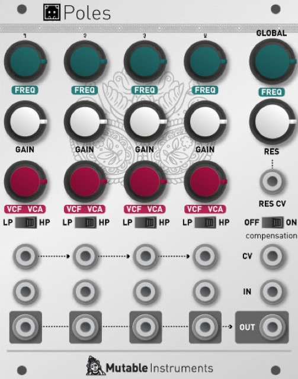
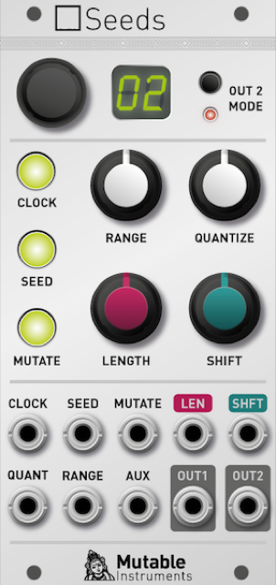
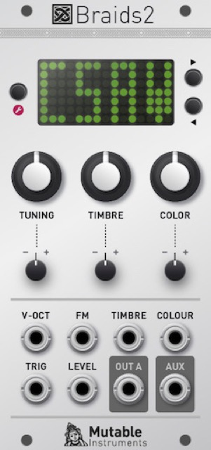
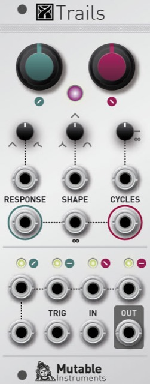
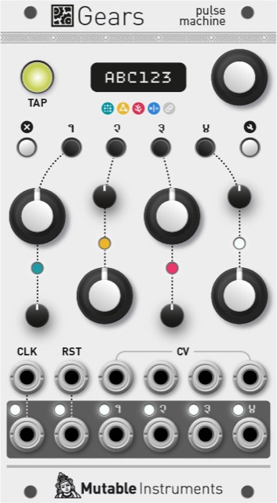
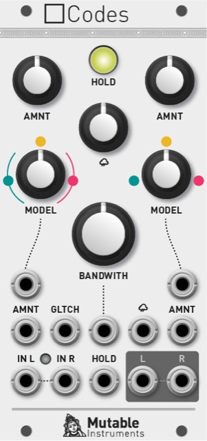

## The first euro module?

> "I have been asked to turn the Shruti oscillator section into a module as early as March 2010. I actually found this mockup in my email archives! I was not super enthusiastic about the project because I did not have a modular at the time - these things looked too expensive, bulky, and 60s. I bought a small Doepfer system at the beginning of 2012, mostly because I was looking for sound and modulation sources to assist in the development of filter boards and other circuits, but I immediately saw the potential in converting some of my existing projects/code to that format."

## Tight (2012)

Audio plug-in to send 16-QAM encoded MIDI through an audio interface + device demodulating this signal and outputting it on a proper DIN MIDI port. Result: MIDI sent with reliable timing, with a stable and predictable (low) delay compared to the other audio tracks, and none of the jitter associated with USB MIDI.

Proof of concept (Audio Unit + firmware running on a STM32F103 devboard) built, but product concept considered too niche.

A commercial product doing something similar has been launched by Expert Sleepers in December 2014, the [USAMO](https://www.expert-sleepers.co.uk/usamo.html).

## Anushri-X (2012)

SMT version of the Anushri monosynth, with an extra digital oscillator (AVR XMega MCU).

## Ambika-X (2012)

> "I've worked on it in 2012 and had almost completed a working prototype by the end of that year. The code I had written for it ultimately became Braids and Yarns".

Originally, each voicecard was a STM32F103 + AD5644R ; then I combined two voices per card, with a STM32F405 MCU, CS4344 for audio, DAC128S085 for the CVs.

> "I evaluated the cost of launching it, and did not continue because I did not want my first manufactured project to be that complicated - and that would have been an investment in the 400k€ range. In retrospect, I'm really happy I did not continue with it. Either it would have sucked, or it would have killed Mutable Instruments."

> "I have completely lost faith in the "digital oscillator + analog filter" formula. There are so many interesting digital techniques (including more than two thirds of those implemented in Braids) that do not really benefit from going through an analog filter. The result is already balanced enough, maybe some cutoff would help, but certainly not resonance. And don't get me started on the ultra-conservative approach to routing and modulations used in Ambika..."

> "This kind of variety you can find in all these digital oscillator models... It's really suited for a Eurorack module. In a Euro system you can decide to throw the oscillator signal straight to an output, or through a filter, or through a VCA, or mix it with another layer..."

> "As for the "XT" interface - I'm kind of unhappy with what I did with the Shruthi: all the parameters are exposed... except the most important... the modulation matrix!"

> "I've experimented with tons of things since 2012 - some of these experiments having given birth to popular Eurorack modules. If I ever returned to a desktop synth, it will be something a bit more original."

## Poles (2012)

Four one-pole VCFA (HP or LP) with various chaining schemes for building larger order filters. Too many uninteresting configurations.

## Blooms (2012)

Dual OTA distortion with a single knob controlling pre/post amount.

## Outs (2013)

Simple output module.

* 1 mono input with VCA and CV panning.
* 1 stereo input.
* 1 stereo headphones output.
* 1 balanced 6.35 output.

## Poles (2015)

Pole-mixing multimode VCF with CV control on order (**SLOPE**), LP->BP->HP morphing (**MODE**) and "inversion" of response (**TILT** LP becomes HP, BP becomes notch, HP becomes LP).

Behind the scenes: Ripples filter, each stage into a V2164 cell. STM32F1 and DAC124S085 to digitally control the gains required to obtain a specific response.

Cancelled when Intellijel released the Polaris.

## Seeds (2015)

Looping random sequencer.

* **CLOCK** to step through a sequence.
* **SEED** to change the value at the current step to a new random value.
* **MUTATE** to randomize the value at all steps.
* **RANGE** is the voltage range - can be changed on the fly to spread the notes in the sequence.
* **SHIFT** transposes the sequence.
* **QUANTIZE** is a variable range quantizer. No quantization fully CCW, only octaves fully CW, notes are removed from the scale inbetween in a meaningful order. **RANGE**  and **SHIFT** are applied before the quantizer.
* **LENGTH** is the loop length.

Trigger inputs for the buttons, CV inputs for the knobs.

When **AUX** is patched, the voltage read there replaces the random value that is sampled whenever SEED is pressed/triggered.

**OUT1** outputs the main CV, **OUT2** can be one of several things: **OUT1** with a time lag, an harmony, or a second random stream (3 little icons were to be drawn on the panel instead of **OUT2 MODE**).

The encoder + mini display is for selecting and editing a scale.

Hardware: STM32F1, DAC8552, MCP3202.

The quantizer code and some of the concepts behind it became part of Marbles.

## Whistle (2015)

The web editor feature in Plaits' latest firmware is actually an offshoot of a project called Whistle that I half-completed in 2016. The goal was to develop a common set of software functionality for handling the V/O input of all the Mutable Instruments modules (and from whoever was willing to reuse the class in their own modules), with features such as:

* Configurable denoising filter and compensation of CV/Gate delays.
* Optional generation of an internal trigger on each change of the V/O input.
* Quantization with scales editable in a browser app.
* Absolute pitch control, irrespective of the central frequency knob (a common question I get is: what is the CV value for a C3).
* CV (and gate) control with a single output of an audio interface, without requiring DC-coupling and calibration.
* Some rough equivalent of SysEx, for making hidden settings of the module editable in a web app.

This was achieved by supporting two signal types for the V/O input (aka “in-band signaling”): the regular V/O CV, and regular MIDI on low bitrate FSK with a 2kHz carrier.

The project was discarded due the difficulty of finding a satisfying common ground between all existing modules - differences in MCU family, CV ADC acquisition rate and noise, and CPU resources available for the decoding. The latency wasn’t great, too. I believe something like this would have potential if it had been planned for the ground up to allow for a faster carrier (V/O input acquired at audio-rate on all modules). Some manufacturers now seem to address a related group of questions with a mini-jack MIDI input on the panel of all their modules.

## Braids 2 (2015-2016)

The refactored Braids codebase became Plaits.

## Trails (2016)

Analog function generator, in the style of a Serge USG but based on a 2164 + 1:4 switch.

Oddities:

* Voltage control on the expo / linear / reverse-expo thing. It had a relatively simple compensation scheme that kept the time/frequency within 0.6x and 1.5x of its central value - but not good enough for stable tracking as a waveshaping VCO.
* Another voltage controlled shape control. It smoothed curve corners (like a LPF on the output, but tracking the A/D time - this one had absolutely no influence on frequency in LFO/VCO mode).
* The one-shot/loop setting was not on/off but was a duration, from 0 to infinity (permanent loop). So it could make looping envelope bursts.
* A 1:4 switch was controlled by the stage (take off, flight, landing, landed) - which was very odd but costed nothing to add because the core of the module was a dual 1:4 switch IC. It was normalized so you could use it in one direction to get gates for each segment, and in the other direction to inject stuff into each segment of the envelope (say I want to replace the stable stage by an external LFO)... Or of course like any 1:4 switch timed by the A/D envelope.

Precisely because it works with a switch IC, the module has a quirk that the Serge 4-transistor "asymmetric multiplier" arrangement doesn't have. The quirk prevented the module from correctly slew-limiting signals which are already slew-limited (like slow triangle or sine LFOs under < 0.5 Hz).

## Gears (2020)

Successor of Grids, with various trigger generation models (original algorithm from Grids, but also euclidean, random, multiply/divide, logic, programmable) and all kinds of menu-editable things (randomization, per-track delay).

PCB designed but never built. A small part of the code written.

## Codes (2020)

Two layers of audio degradation models, one centered on noise or glitches, the other on recording media or audio codec emulation.
